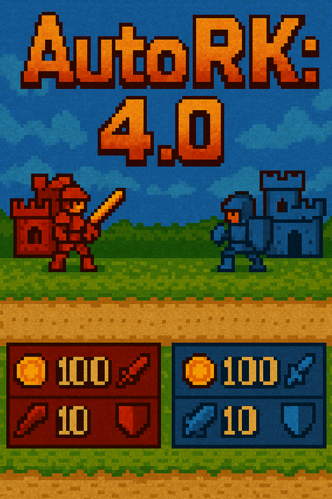

# AutoRK: 4.0

Простая библиотека для сдачи рубежного контроля

**AutoRK: 4.0** – минималистичный, но расширяемый Python‑фреймворк для пошаговых дуэлей стратегий‑ботов. Поддерживает как консольный, так и графический режимы (Pygame).

---

# Руководство по библиотеке **autork**

